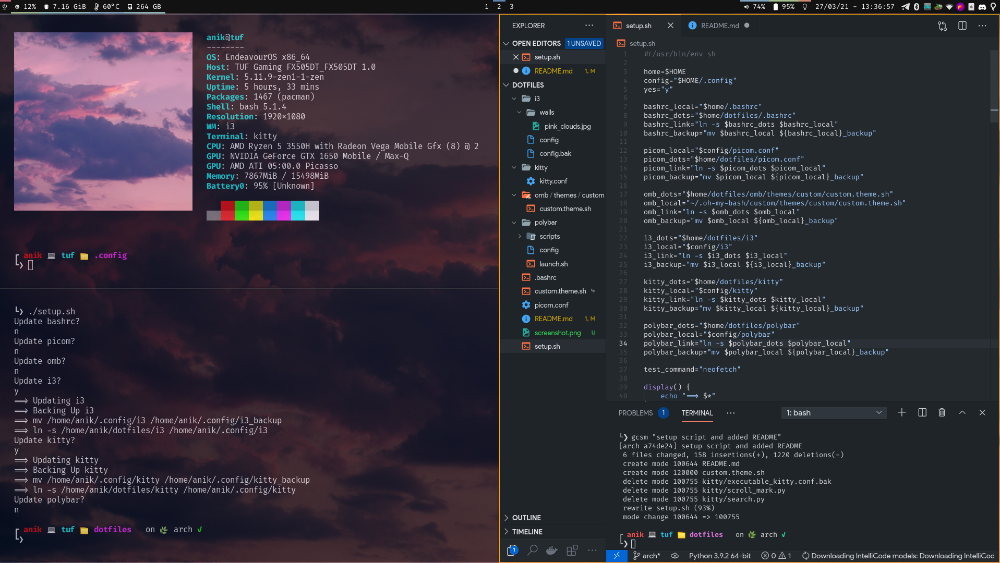

# dotfiles (arch + i3 + polybar)

## usage

- clone repo to home dir (IMPORTANT)
- chmod +x setup.sh
- run setup.sh

## deps

- albert
- polybar
- i3-gaps
- kitty
- redshift (if you need warmer screen)
- oh-my-bash
- picom
- nm-applet
- feh
- nautilus, flameshot, optimus-manager (optional, remove from i3 config if not needed)
- polkit agent (gnome in i3 config)

## screenshot

